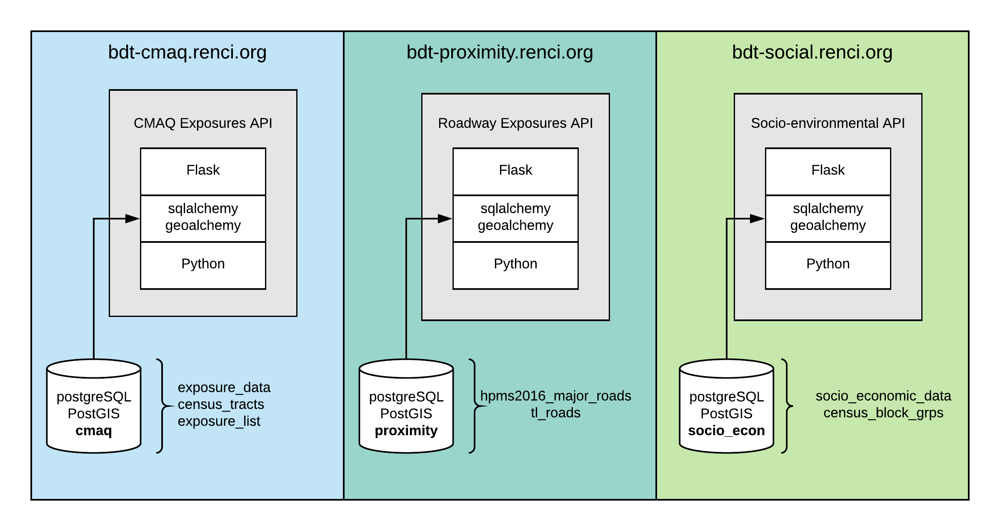

DRAFT: 09/11/18

Lisa Stillwell, Alejandro Valencia

Description
===========

This document provides an overview of 3 APIs developed for the Data
Translator project. They include: CMAQ Exposures, Roadway Exposures, and
Socio-economic Exposures.

First, the method of development is discussed, then an overview
operation is presented.

Development Method 
===================

API Creation with Swagger
-------------------------

The Swagger (https://swagger.io) toolset facilitates the automatic
generation of an OpenAPI document (yaml format). The swagger-codegen
tool is used to create boilerplate source code for the implementation of
the API. The APIs described in this overview, were created using the
Python/Flask code generator.

### SwaggerHub Links

SwaggerHub is a API definition repository. Users are allowed 3 free API
definitions per account. The exposure API definitions are located here:

-   CMAQ -
    <https://app.swaggerhub.com/apis/proximity_api/cmaq-exposures-api/1.0.0>

-   Roadway -
    <https://app.swaggerhub.com/apis/proximity_api/roadway-exposures-api/1.0.0>

-   Socio-economic -
    <https://app.swaggerhub.com/apis/proximity_api/socio-environmental-exposures-api/1.0.1>

API Data
--------

### CMAQ

The new, expanded CMAQ data was provided in CSV format for years 2010 –
2014. There are 2 files for each year that average 1.62Gb in size. The 2
files contain pm2.5 daily averages and ozone daily 8-hour maximum data.
These 2 files were merged, with a python script, to facilitate database
insertion. The features provided in the CSV file are:

-   Date – day, month, year of data reading

-   FIPS – (Federal Information Processing Standards) code to specify
    state, county, census tract that the data apply to.

-   Longitude, Latitude – the location of the centroid of the census
    tract

-   ozone\_daily\_8hour\_maximum, ozone\_daily\_8hour\_maximum_stderr –
    data value/info

-   pm25\_daily\_average, pm25\_daily\_average\_stderr – data value/info

US census tract data was obtained from census.gov for all US states, in
shapefile format.

The census tract dataset contains a similar FIPS code that can be used
to match the FIPS code in the CMAQ data.

### Roadway

The roadway exposure API uses Highway Performance Monitoring System
(HPMS) for 2016. This was obtained from The Federal Highway
Administration (FHWA). It only contains major roads (or primary roads).
This includes interstates, principal arteries, minor arteries, and major
collectors. The dataset included information such as road type, speed
and annual average daily traffic (AADT) for most road segments. Post
processing was performed using TIGER (Topologically Integrated
Geographic Encoding and Referencing) data from census.gov, to obtain
road type when it was not available. A variety of methods were used to
populate missing AADT and speeds. Finally, road segments without this
information were dropped from the dataset.

### Socio-economic

The socio-economic, or socio environmental data was provided in CSV
format. It contains 2016 American Community Survey (ACS) data for the
entire US. The features provided in the ACS data are:

-   GEOID – a FIPS like code for identifying which census block group
    this data pertains to.

-   EstResidentialDensity – estimated total population

-   EstResidentialDensity_SE – estimated total population standard error

-   EstResidentialDensity25Plus - estimated total population of people
    age 25 and older
    
-   EstResidentialDensity25Plus_SE - estimated total population of people
    age 25 and older standard error

-   EstProbabilityNonHispWhite – estimated probability of non-Hispanic
    white
    
-   EstProbabilityNonHispWhite_SE – estimated probability of non-Hispanic
    white standard error

-   EstProbabilityHighSchoolMaxEducation - estimated probability of high
    school as maximum education
    
-   EstProbabilityHighSchoolMaxEducation_SE - estimated probability of high
    school as maximum education standard error

-   EstProbabilityNoAuto - estimated probability of no automobile

-   EstProbabilityNoAuto_SE - estimated probability of no automobile standard error

-   EstProbabilityNoHealthIns - estimated probability of no health
    insurance
    
-   EstProbabilityNoHealthIns_SE - estimated probability of no health
    insurance standard error

-   EstProbabilityESL – estimated probability of no English language

-   EstProbabilityESL_SE – estimated probability of no English language standard error

-   EstHouseholdIncome – estimated household income

-   EstHouseholdIncome_SE – estimated household income standard error

Also, US census block group data was obtained from census.gov for all US
states, in shapefile format.

The census block group dataset contains a similar FIPS code that can be
used to match the FIPS code in the ACS data.

PostgreSQL – Loading Disparate Data
-----------------------------------

A PostgreSQL database with PostGIS extension is used for each exposure
API. SQL and bash scripts were created to load CSV and shapefile data
into the databases.

SQLacodegen
-----------

The sqlacodegen tool was used to generate database schema models and
class definitions that are used by the sqlalchemy, geoalchemy python
packages. Sqlalchemy and geoalchemy are used in the API logic to perform
database queries that also calculate distances and other spatial
relationships.

API logic implementation
------------------------

The implementation of the exposure APIs all use simple queries to return
exposure data.

All of the APIs require a geographic coordinate as input.

The CMAQ exposures API uses latitude, longitude, and date range to
return pm2.5 and ozone exposure data for each day in the date range.
This is done by using PostGIS functions to determine which census tract
contains the input coordinate. Then the FIPS code of that census tract
is used to match FIPS codes in the CMAQ data.

The ACS API data query is similar to this, but uses census block groups
instead of census tracts.

The roadway API query uses PostGIS functions to find the closest roadway
segment to a given coordinate, and returns distance to the roadway and
that roadway’s metadata.

Github Repositories
-------------------

### CMAQ - https://github.com/lstillwe/cmaq-exposures-api

### Roadway - <https://github.com/valenal/roadway-proximity-api>

### Socio-economic - https://github.com/lstillwe/socio-economic-api

Operation
=========

The swagger code generator provides a basic html UI to perform API
queries. The exposure APIs can be accessed with the following links.

Expanded Coverage CMAQ Exposures API – years 2010 – 2014
--------------------------------------------------------

### URL - http://bdt-cmaq.renci.org:8080/cmaq_exposures_api/v1/ui/#!/default/get_values

### Usage

Provide date range, geographic coordinate, in decimal degrees format,
and utc\_offset (default utc).

Example input:
```
curl -X GET --header 'Accept: application/json'
'http://bdt-cmaq.renci.org:8080/cmaq_exposures_api/v1/values?start_date=12-30-2013&end_date=01-03-2014&latitude=34.55&longitude=-79.44&utc_offset=utc'
```

Example output:
```
{
 "values": [
  {
   "cmaq_output": [
    {
     "date": "2013-12-30",
     "value": 24.827
    },
    {
     "date": "2013-12-31",
     "value": 24.136
    },
    {
     "date": "2014-01-01",
     "value": 30.123
    },
    {
     "date": "2014-01-02",
     "value": 27.676
    },
    {
     "date": "2014-01-03",
     "value": 36.383
    }
  	],
   	"latitude": "34.55",
   	"longitude": "-79.44",
   	"variable": "ozone_daily_8hour_maximum"
    },
  {
   "cmaq_output": [
    {
     "date": "2013-12-30",
     "value": 6.215
    },
    {
     "date": "2013-12-31",
     "value": 10.383
    },
    {
     "date": "2014-01-01",
     "value": 16.218
    },
    {
     "date": "2014-01-02",
     "value": 8.007
    },
    {
     "date": "2014-01-03",
     "value": 7.606
    }
   	],
    "latitude": "34.55",
    "longitude": "-79.44",
    "variable": "pm25_daily_average"
   }
  ]
}
```

Roadway Exposures API
---------------------

### URL - http://bdt-proximity.renci.org:8080/roadway_proximity_api/v1/ui/#!/default/get_distance

### Usage

Provide geographic coordinate, in decimal degrees format, and distance
limitation perimeter (in meters) Default is 500 meters.

Example input:
```
curl -X GET --header 'Accept: application/json'
'http://bdt-proximity.renci.org:8080/roadway_proximity_api/v1/distance?latitude=35.8968&longitude=-79.05&limit_distance=500'
```
Example output:
```
{
  "aadt":45000,
  "distance":199.21980213,
  "latitude":35.8968,
  "longitude":-79.05,
  "roadtype":"Urban Restricted Access",
  "route_id":"20000015068",
  "speed":45,
  "through_lanes":4
}
```
Socio-economic Exposures API
----------------------------

### URL - http://bdt-social.renci.org:8080/socio_environmental_exposures_api/v1/ui/#!/default/get_values

### Usage

Provide geographic coordinate, in decimal degrees format.

Example input:
```
curl -X GET --header 'Accept: application/json'
'http://bdt-social.renci.org:8080/socio_environmental_exposures_api/v1/values?latitude=34.55&longitude=-79.44'
```
Example output:
```
{
  "EstPropHouseholdsNoAuto": "0.0387323943661972",
  "EstPropHouseholdsNoAuto_SE": "0.039252128205847",
  "EstPropNonHispWhite": "0.763758389261745",
  "EstPropNonHispWhite_SE": "0.105181283383554",
  "EstPropPersons25PlusHighSchoolMax": "0.531645569620253",
  "EstPropPersons25PlusHighSchoolMax_SE": "0.0764804287594837",
  "EstPropPersons5PlusNoEnglish": "0.0750708215297451",
  "EstPropPersons5PlusNoEnglish_SE": "0.040387048517137",
  "EstPropPersonsNoHealthIns": "0.183892617449664",
  "EstPropPersonsNoHealthIns_SE": "0.0633283349669971",
  "EstTotalPop": "745",
  "EstTotalPop25Plus": "474",
  "EstTotalPop25Plus_SE": "76.006249743031",
  "EstTotalPop_SE": "137.530360284557",
  "MedianHouseholdIncome": "$29744.00",
  "MedianHouseholdIncome_SE": "20687.8291659613",
  "geoid": "15000US010010201001",
  "latitude": "32.47",
  "longitude": "-86.5"
}
```

Architecture Diagram
====================


